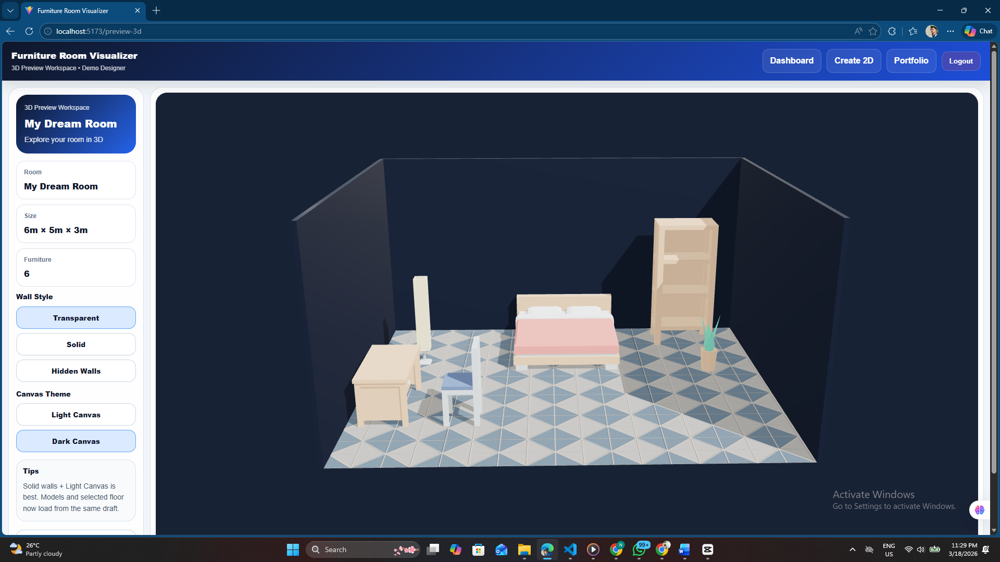
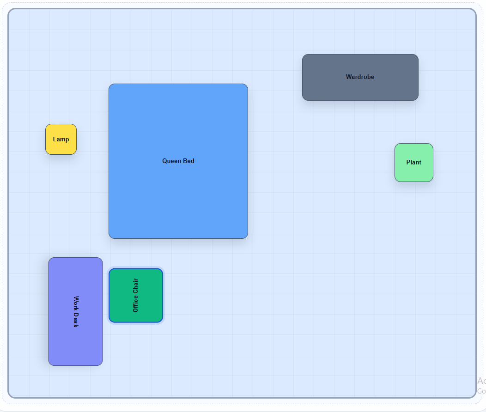
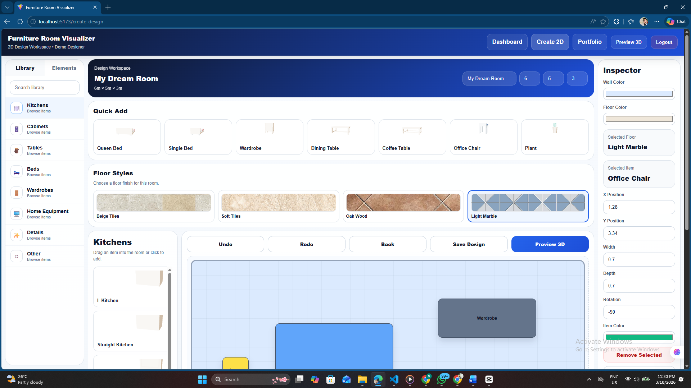

# 🛋️ Furniture Designer (2D + 3D Room Planner)

An interactive web-based application that allows users to design and visualize room layouts in both 2D and 3D. This system helps furniture designers and customers create, modify, and preview room arrangements in real-time.

---

## 🚀 Features

- 🧱 Create room layouts using a 2D grid system
- 🪑 Add, move, and arrange furniture items
- 🔄 Undo / Redo functionality
- 💾 Save and load designs using LocalStorage
- 🎨 Basic color customization
- 🧊 3D preview of room layouts using Three.js
- 📦 Predefined furniture library (beds, tables, cabinets, etc.)

---

## 🧑‍💻 Technologies Used

- **Frontend:** React.js
- **3D Rendering:** Three.js
- **State Management:** React Context API
- **Styling:** CSS / Tailwind (if used)
- **Storage:** Browser LocalStorage

---

## 📂 Project Structure


src/
│
├── components/ # UI components
├── pages/ # Main pages (Create Design, Dashboard, etc.)
├── context/ # State management (DesignContext)
├── data/ # Furniture data
├── hooks/ # Custom hooks (Undo/Redo)
├── utils/ # Helper functions
└── assets/ # Images / 3D models (.glb)


---

## ⚙️ Installation & Setup

1. Clone the repository

```bash
git clone https://github.com/your-username/furniture-designer.git

Navigate to project folder

cd furniture-designer

Install dependencies

npm install

Run the project

npm start
📸 Screenshots

  

⚠️ Limitations

3D models are not fully realistic

Limited lighting and shading in 3D view

No backend/database (uses LocalStorage only)

Limited customization (scaling, colors)

Some models may fail to load if paths are incorrect

🔮 Future Improvements

Add real-time lighting and shadows

Improve 3D model quality and textures

Add backend (Firebase / Node.js)

Enable drag-and-drop UI improvements

Advanced room customization (shapes, materials)

📌 Project Links

🔗 GitHub Repository: https://github.com/kvndu/furniture-room-visualizer-web
